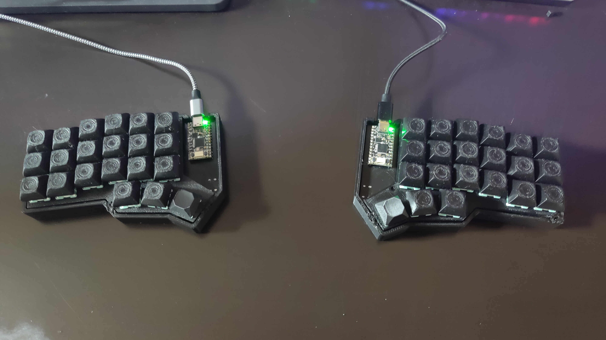

# Tybeast Ones HE

 The Tybeast Ones HE is a split hall effect mechanical keyboard heavily
 inspired by the Corne. Written using the Rust Embassy framework.

## Loading Firmware

To load the firmware, you'll need to have [elf2uf2-rs](https://github.com/JoNil/elf2uf2-rs).
Once the KB2040 is in bootsel mode, you can use

`cargo run --release --bin <OPTION>`

where OPTION consists of either "left" or "right" depending on which
side you're loading for.

## Making Both Sides Connect

I for the life of me couldn't figure out how to solder a USB-C receptacle onto the PCB
so the firmware will have to use the HID protocol to communicate with
one another rather than using something like UART.
This can be done by using [Keyboard-Link](https://github.com/Tybuu/link).

## Components used in PCB

* Linear Hall Effect Sensors: AH49FNTR-G1
* Analog Multiplexers: CD74HC4051M96
* Dev Board: Adafruit KB2040
